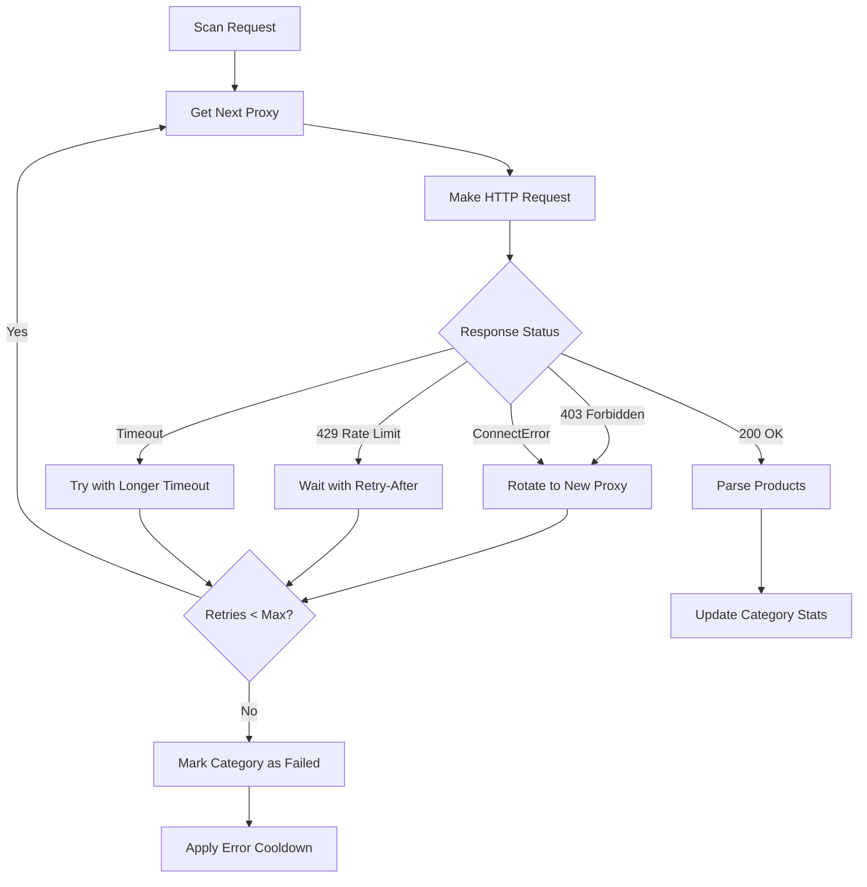

# Fix Scan Connection Errors and Failed Scans

## Problem Analysis

From the scan log, we identified several critical issues:

1. **403 Forbidden Errors**: Multiple retailers (costco, macys, lowes, newegg, gamestop, kohls, bhphotovideo) consistently return 403 errors after 3 retry attempts
2. **ReadTimeout Errors**: BestBuy consistently times out, suggesting proxy slowness or insufficient timeout
3. **ConnectError**: "All connection attempts failed" errors indicate proxy connection failures aren't handled gracefully
4. **404 Errors**: Some category URLs are stale (microcenter, newegg) - already handled by auto-disable
5. **No Products Parsed**: Many pages return 200 OK but parse 0 products (separate selector issue)

## Root Causes

1. **Ineffective Proxy Rotation**: On 403 errors, code sets `proxy = None` but doesn't force a new proxy on retry
2. **Insufficient Timeout**: 45s timeout may be too short for slow proxies, especially for BestBuy
3. **No ConnectError Handling**: Connection failures don't trigger immediate proxy rotation
4. **Static User Agent**: Same user agent used across retries for same domain
5. **Insufficient Backoff**: 403 errors use short backoff (5-20s) which may trigger rate limiting
6. **No Proxy Health Tracking**: Failed proxies aren't temporarily excluded from rotation

## Solution Architecture



## Implementation Plan

### Phase 1: Enhanced Proxy Rotation

**File**: `src/ingest/category_scanner.py`

1. **Force Proxy Rotation on 403 Errors**

   - Modify `_scan_single_page` to track used proxies per request
   - On 403 error, explicitly get a different proxy (not just set to None)
   - Add `used_proxies: set[int]` to track proxies already tried for this request
   - Ensure each retry uses a different proxy when available

2. **Improve Proxy Selection**

   - Modify `proxy_rotator.get_next_proxy()` to accept exclusion list
   - Add `get_next_proxy(exclude_ids: Optional[set[int]] = None)` method in `ProxyRotator`
   - Skip proxies that have failed for this request

**File**: `src/ingest/proxy_manager.py`

3. **Add Proxy Exclusion Support**

   - Add `get_next_proxy(exclude_ids: Optional[set[int]] = None)` parameter
   - Filter out excluded proxy IDs from rotation
   - Ensure at least one proxy is available before returning None

### Phase 2: Timeout and Connection Error Handling

**File**: `src/ingest/category_scanner.py`

4. **Dynamic Timeout Adjustment**

   - Increase timeout for ReadTimeout errors on retry
   - Use `httpx.Timeout(connect=10.0, read=60.0, write=10.0, pool=5.0)` for better control
   - For BestBuy specifically, use longer read timeout (90s) on first timeout

5. **Handle ConnectError Explicitly**

   - Catch `httpx.ConnectError` separately from other exceptions
   - Immediately rotate to next proxy on ConnectError
   - Don't count ConnectError as a full retry attempt (quick failover)

6. **User Agent Rotation Per Retry**

   - Rotate user agent on each retry attempt, not just per client
   - Store user agent in client key or pass as parameter
   - Ensure different user agent for each retry to avoid fingerprinting

### Phase 3: Improved Retry Strategy

**File**: `src/ingest/category_scanner.py`

7. **Enhanced 403 Error Handling**

   - Increase backoff time for 403 errors: `(2 ** retry_count) * 15 + random.uniform(5, 15)`
   - Add longer cooldown after persistent 403s (use existing `category_error_cooldowns`)
   - Log proxy IP when 403 occurs to identify problematic proxies

8. **Retry Logic Refactoring**

   - Separate retry logic for different error types:
     - **403**: Long backoff + proxy rotation + user agent change
     - **429**: Respect Retry-After header (already implemented)
     - **Timeout**: Increase timeout + try different proxy
     - **ConnectError**: Immediate proxy rotation (no backoff)
   - Track error types separately to apply appropriate strategies

### Phase 4: Error Cooldown and Category Management

**File**: `src/ingest/scan_engine.py`

9. **Enhanced Error Cooldown**

   - Ensure `_is_category_in_cooldown` properly checks error cooldowns
   - Add cooldown for "ConnectError" type errors
   - Extend 403 cooldown to 8 hours (from 6) for persistent failures

**File**: `src/config.py`

10. **Update Error Cooldown Configuration**

    - Add `"ConnectError": 30 * 60` (30 minutes) to `category_error_cooldowns`
    - Increase `"HTTP 403"` cooldown from 6 hours to 8 hours
    - Add `"ReadTimeout": 30 * 60` (30 minutes) if not already present

### Phase 5: HTTP Client Configuration

**File**: `src/ingest/category_scanner.py`

11. **Better Timeout Configuration**

    - Replace single `timeout=settings.category_request_timeout` with structured timeout:
      ```python
      timeout = httpx.Timeout(
          connect=10.0,      # Connection timeout
          read=settings.category_request_timeout,  # Read timeout (45s default)
          write=10.0,        # Write timeout
          pool=5.0           # Pool timeout
      )
      ```

    - For retries after timeout, increase read timeout to 90s

12. **Client Per Proxy**

    - Ensure each proxy gets its own HTTP client (already implemented via client_key)
    - Add proxy ID to client key to ensure proper isolation
    - Close and recreate clients when proxy changes to avoid connection reuse issues

### Phase 6: Logging and Monitoring

**File**: `src/ingest/category_scanner.py`

13. **Enhanced Error Logging**

    - Log proxy information (IP:port) when errors occur
    - Log user agent used for each request
    - Track error patterns per proxy to identify problematic proxies
    - Add metrics: proxy success rate, error types per retailer

### Phase 7: Fallback Strategies

**File**: `src/ingest/category_scanner.py`

14. **Direct Connection Fallback** (Optional - if user wants)

    - After all proxy retries fail, try direct connection (no proxy)
    - Only for non-sensitive retailers or as last resort
    - Log when falling back to direct connection

## Implementation Details

### Key Code Changes

1. **`src/ingest/category_scanner.py` - `_scan_single_page` method**:

   - Add `used_proxies: set[int] = set()` at start of method
   - On 403/ConnectError, add current proxy ID to `used_proxies`
   - Call `proxy_rotator.get_next_proxy(exclude_ids=used_proxies)` on retry
   - Rotate user agent on each retry
   - Increase timeout for ReadTimeout retries

2. **`src/ingest/proxy_manager.py` - `ProxyRotator.get_next_proxy`**:

   - Add `exclude_ids: Optional[set[int]] = None` parameter
   - Filter `self._proxies` to exclude IDs in `exclude_ids`
   - Return None only if no proxies available after filtering

3. **`src/config.py` - Settings**:

   - Update `category_error_cooldowns` with new values
   - Consider adding `category_request_timeout_retry: float = 90.0` for timeout retries

## Testing Strategy

1. **Unit Tests**:

   - Test proxy rotation with exclusion list
   - Test timeout increase on retry
   - Test ConnectError handling

2. **Integration Tests**:

   - Test full scan with multiple 403 errors
   - Test proxy rotation across multiple retries
   - Test cooldown application after persistent failures

3. **Manual Testing**:

   - Run scan and monitor logs for proxy rotation
   - Verify 403 errors trigger proxy changes
   - Verify timeouts increase on retry
   - Check error cooldowns are applied correctly

## Success Criteria

- 403 errors trigger immediate proxy rotation
- ReadTimeout errors increase timeout on retry
- ConnectError immediately tries different proxy
- Categories with persistent 403s enter appropriate cooldown
- Better success rate for previously failing retailers
- Reduced scan failures overall

## Risk Mitigation

- Gradual rollout: Test with one retailer first
- Monitor proxy usage to ensure rotation works
- Track error rates before/after changes
- Keep existing retry logic as fallback
- Add feature flags for new behaviors if needed. Add detailed logging for proxy information, user agents, and error patterns