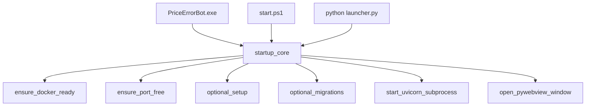

# Unified Startup: PriceErrorBot.exe + start.ps1 + launcher.py

## Goal

When the user launches `dist\PriceErrorBot.exe`, it should **perform the same startup workflow** currently split across `start.ps1` and `launcher.py`, **without** starting multiple servers or competing for port 8001. Per your preference, the exe may call scripts, but it should behave as the **single orchestrator** (i.e., “replace” them, not run them all concurrently).

## Key Constraint

- `start.ps1` and `launcher.py` both contain startup responsibilities (port checks, Docker readiness, uvicorn start). If the exe literally runs `start.ps1` and also runs `launcher.py` as-is, you risk:
  - Two uvicorn instances
  - Port 8001 fights
  - Zombie processes on close

So the plan is to **refactor to one authoritative startup flow** and have the exe drive it.

## Proposed Architecture

Create a shared Python “startup core” module that contains the logic currently duplicated between `start.ps1` and `launcher.py`. Then:

- `PriceErrorBot.exe` runs the Python startup core and opens the UI window.
- `python launcher.py` becomes a thin wrapper around the same startup core.
- `start.ps1` becomes a thin wrapper around the same startup core (or calls the same Python entrypoint).

### Mermaid: New Control Flow

## Phase 1 — Inventory current startup behavior

**Why:** we need to avoid regressions and double-start.

- Review responsibilities in:
  - [launcher.py](launcher.py)
  - [start.ps1](start.ps1)
  - `src/main.py` uvicorn entrypoint (how server is started)
  - `src/logging_config.py` (where logs go)

**Output:** a checklist of steps the unified core must cover.

## Phase 2 — Create shared startup core module

**Create:** `src/startup/core.py` (new)

### Functions to include (lift from existing code)

- `ensure_docker_ready()`
  - Check docker daemon
  - Start containers (postgres/redis + monitoring if desired)
  - Verify container health
- `ensure_port_free(port: int)`
  - Find process(es) bound to the port
  - Kill them (with user-friendly logging)
  - Wait until port is free
- `run_migrations_if_needed()` (optional toggle)
  - Run `alembic upgrade head` if configured
- `seed_categories_if_needed()` (optional toggle)
  - Run `python scripts/seed_categories.py` if configured
- `start_server_process(host, port)`
  - Start uvicorn as a **subprocess** (preferred) so it’s independent of the UI thread
  - Wait for `http://127.0.0.1:8001/health` or `/` readiness
- `stop_server_process(proc)`
  - Graceful shutdown (terminate, then kill fallback)

### Why subprocess (vs thread)

- Easier to stop cleanly when the UI window closes
- Matches how PS scripts behave
- Prevents accidental event-loop/thread issues

### Configuration input

- Read from environment / `.env` and reuse `src/config.py` where possible.
- Add a `StartupOptions` dataclass (new) to control:
  - `skip_docker`
  - `skip_port_kill`
  - `run_migrations`
  - `seed_categories`
  - `open_ui`
  - `server_host` / `server_port`

## Phase 3 — Make launcher.py call the startup core

**Modify:** [launcher.py](launcher.py)

- Replace duplicated logic with calls into `src/startup/core.py`.
- `launcher.py` becomes:
  - Parse options
  - Call startup core
  - Launch pywebview window
  - On close: stop server process

**Result:** `python launcher.py` and `PriceErrorBot.exe` share identical behavior.

## Phase 4 — Make start.ps1 call the same core (no duplicated logic)

**Modify:** [start.ps1](start.ps1)

Two acceptable approaches (choose one):

### Option A (recommended): start.ps1 calls a Python entrypoint

- `start.ps1` does only:
  - Activate venv (if present)
  - Run: `python -m src.startup.cli --no-ui`

### Option B: keep start.ps1 but remove server-start overlap

- If you insist start.ps1 stays “in charge,” then `launcher.py` must never be launched afterwards.
- This is **not recommended** because it reintroduces split-brain behavior.

Given your choice (“replace them”), we do **Option A**.

## Phase 5 — Build the exe to run the same entrypoint

**Modify:** [launcher.spec](launcher.spec) and/or [build_exe.ps1](build_exe.ps1)

- Ensure the packaged exe runs `launcher.py` (or a new `src/startup/cli.py`) as the entrypoint.
- Ensure hidden imports include:
  - `psutil`
  - `uvicorn`
  - `fastapi`
  - `sqlalchemy` async deps
  - anything required by Playwright if used at runtime

**Important:** If the exe is allowed to call scripts, it can still do so, but it should not rely on them to start the server.

## Phase 6 — Logging visibility (so users can debug)

**Modify:** [src/logging_config.py](src/logging_config.py) and/or launcher runtime settings

- Ensure `logs/app.log` and `logs/error.log` remain authoritative.
- If exe is windowed (no console), add an option to:
  - Write an additional human-readable log: `logs/launcher.log`
  - Or show a “View Logs” button in the UI that opens the logs folder.

## Phase 7 — Acceptance tests (manual)

1. **Exe path**

   - Double-click `dist\PriceErrorBot.exe`
   - Confirms:
     - Docker is started/verified
     - Port 8001 is freed
     - Server starts
     - UI opens

2. **Script path**

   - Run `./start.ps1`
   - Confirms:
     - Same startup behavior
     - No double server

3. **Developer path**

   - Run `python launcher.py`
   - Confirms:
     - Same startup behavior

4. **Shutdown**

   - Closing UI window stops server process (no orphan uvicorn)

## Files expected to change

- New: [`src/startup/core.py`](src/startup/core.py)
- New (optional): [`src/startup/cli.py`](src/startup/cli.py)
- Modify: [`launcher.py`](launcher.py)
- Modify: [`start.ps1`](start.ps1)
- Modify: [`launcher.spec`](launcher.spec)
- Modify: [`build_exe.ps1`](build_exe.ps1)
- Optional: [`src/logging_config.py`](src/logging_config.py)

## Rollout strategy

- Implement startup core + wire `launcher.py` first
- Update `start.ps1` to delegate to the Python entrypoint
- Rebuild exe and validate end-to-end